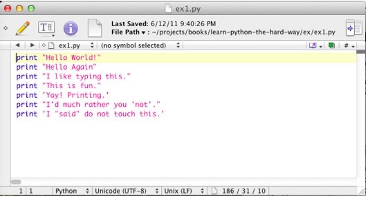
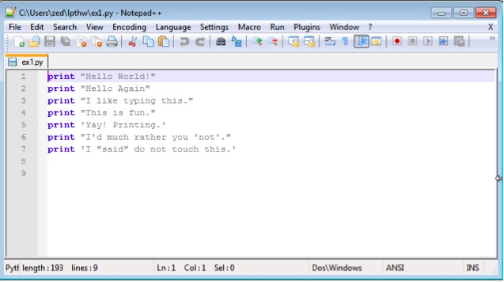
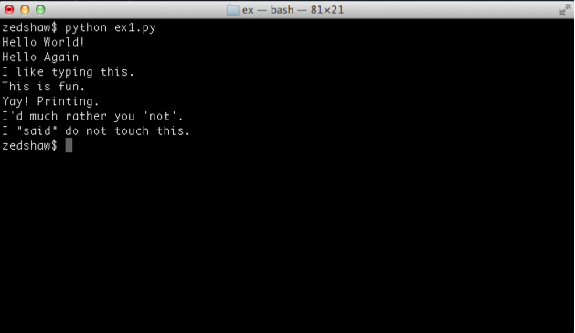
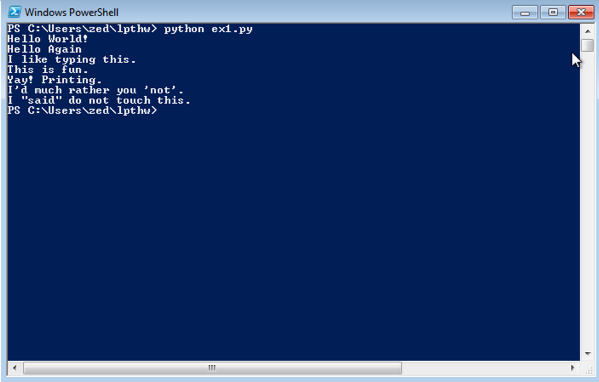

#第一章
###一个比不错的入门程序

记住你应该多花点时间从练习0中学习如何安装编辑器，运行编辑器，运行Terminal，然后用他们一起来工作。如果你没有完成那一步，请不要继续下去。否则你接下来的日子不会舒服的。这是唯一的一次我在开始练习前提醒你不要跳跃。  
把下面的文字打入一个名为ex1.py的文件中，这很重要，因为python最擅长运行.py结尾的文件。

`print "Hello World!"
print "Hello Again"
print "I like typing this."
print "This is fun."
print 'Yay! Printing.'
print "I'd much rather you 'not'." 
print 'I "said" do not touch this.'`

如果你使用Mac OSX，如果你用的是Textrangler，那么你的编辑器看起来会像下面这样  
  

如果你再Windows上使用Notepad++那么它看起来像下面这样  

如果你的编辑器看看起来和上面不是那么一样，不用担心，关键点如下：
1. 注意我没有输入左侧的列号（1-7）。它们被打印在书中以便于我可以通过指出行号来谈论特定的一行，比如说“看第5行”，你不需要把这些也打进Python脚本中。
2. 注意我把`print`放在了一行的开始，它看起来的样子和我写的样子一模一样，一模一样地意思是“一模一样”，不是部分一样。每一个字幕都要匹配才能运行。但是，颜色是不同地，颜色不重要，只有你打地字母最重要。

然后在Terminal中打下面的代码来运行：

`python ex1.py`

如果你做的正确的话，泥浆看到和下面一样的输出。如果样子不一样，那么你肯定是做错了什么。对不起，电脑是不会错的。

###你应该看到的样子
在Mac OS X上你在Terminal中会看到下面的东西：

而在windows上的PowerShell中你会看到下面的东西：

你可能看到的是不同的名字，就是在`python ex1.py`前面的你电脑或者其他东西的名字，但是你输入的命令和你看到和我的一样的输出才是最重要的部分。  

如果你遇到了错误，那么它将看起来像下面这样：

`$ python ex/ex1.py  
File "ex/ex1.py", line 3  
  print "I like typing this.
  
  SyntaxError: EOL while scanning string literal"`
  
 因为你可能会遇到好几个错误，所以能过理解上面的那段话是很重要的。甚至我都写了好几个错误。让我们一行一行的看一下。
 
 1. 我们在terminal中运行了我们的命令来启动ex1.py脚本。
 2. Python告诉我们ex1.py文件在第三行有一个错误。
 3. 然后它把这一行给我们打印出来了。
 4. 然后它输出了一个^（脱字符）符号指出问题出在哪里。注意到丢了一个"(双引号)符号
 5. 最后，它打印了一个“SyntaxError”然后告诉我们这个错误可能是什么。通常他们是含糊不清的，但是如果你把这段话复制到搜索引擎中，你将会看到其他某些人之前就遇到过这种错误，然后你可能很容易就找到如何解决这个错误。
 
####警告
如果你在其他国家，你遇到了一个关于ASCII编码的错误，那么把下面这行代码放到你的python脚本的顶部：

`# -*- coding: utf-8 -*-`

这样你在使用UTF-8代码的时候就会解决这个问题。

###

 