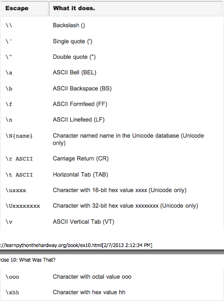

#那是什么？

在联系9中，我给了你一些新东西，就是为了要你保持警惕。我给你展示了两种书写多行字符串的方法。在第一种方法中，我把字符\n（反斜杠 n）放在月份之间。这两个字符的功能就是在那里放一个字符串换行符。

使用\（反斜杠）的作用就是我们能把一个很难打印出来的字符输入到字符串中去。有很多这种你可能想使用的“转义字符”，但是有一个很特殊的，就是两个反斜杠\\。这两个字符只会打印一个反斜杠。我们将尝试一下这些符号，这样你就会知道我是什么意思。

另外一个重要的转义字符是转义单引号'和双引号"。假设你有一个字符串使用了单引号，而且你想在输出的外面加上一个双引号。如果你这样写"I " understand" joe."，那么python将会不明白你什么意思，因为它认为"understand"两边的"就是字符串的结束。你需要一种方法来告诉Python字符串中的"不是一个真正的双引号。

为了解决这个问题，你可以把单引号和双引号转义，这样Python就知道在字符串中加入了双引号。比如下面这样    
`"I am 6'2\" tall." # escape double-quote inside string 
'I am 6\'2" tall.' # escape single-quote inside string`

第二种方法是使用三个引号，就是"""，它会像字符串一样起作用，但是你可以把很多行文字放在里面，直到你用"""来结尾，就像下面这样。

`tabby_cat = "\tI'm tabbed in." 
persian_cat = "I'm split\non a line." 
backslash_cat = "I'm \\ a \\ cat."
fat_cat = """
I'll do a list:
\t* Cat food
\t* Fishies
\t* Catnip\n\t* Grass """
print tabby_cat 
print persian_cat 
print backslash_cat 
print fat_cat`

##你看到的样子
看看你输入的tab符号，在练习中，空格对于你输入正确很重要。

`$ python ex10.py I'm tabbed in.
I'm split
on a line.
I'm \ a \ cat.
I'll do a list: * Cat food
   * Fishies
  * Catnip
  * Grass`

##转义字符
下面列出来了所有的Python支持的转义字符。你可能不是用其中的大部分的符号，但是无论如何记住他们的格式和他们的作用。然后在一些字符串中试试，看看他们是起什么作用的。

这里是你需要尝试的一小点代码

`while True:
    for i in ["/","-","|","\\","|"]:
    print "%s\r" % i,`

##进阶练习

1. 把所有的转义字符放到速记卡中来记住这些转义字符。
2. 使用'''来代替"""，你能看懂为什么有时候你要使用'''而不是"""吗？
3. 使用转义字符和格式化字符串来制造更复杂的格式。
4. 还记得%r格式化吗？用转义的双引号和单引号把他们打印出来。比较一下%r和%s，%r会按照你将在文件中写的方式来打印出来，而%s会按照你将看到的方式来打印出来。

##学生提问

1. **我还没有看明白最后一个练习，我应该继续吗？** 是的，继续下去，与其停下来做笔记，不如列下每次练习中你不知道的东西。周期性回顾你的笔记，然后在你完成更多练习以后查看这些东西。有时候你可能需要回顾一些练习的时候那就回顾一下。
2. **当我使用%r的时候，为什么转义字符不起作用？** 这是因为%r会把你输入的内容全部打印出来，这将会包括原始的转义字符，要使用%s。记住%r是debug用的，%s才是输出用的。
